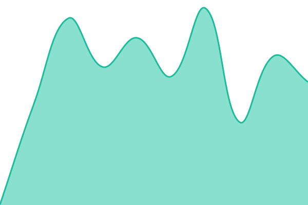

# [📈 Live Status](https://80px.github.io/uptime): <!--live status--> **🟩 All systems operational**

This repository contains the open-source uptime monitor and status page for [80px](https://80px.com), powered by [Upptime](https://github.com/upptime/upptime).

With [Upptime](https://upptime.js.org), you can get your own unlimited and free uptime monitor and status page, powered entirely by a GitHub repository. We use [Issues](https://github.com/80px/uptime/issues) as incident reports, [Actions](https://github.com/80px/uptime/actions) as uptime monitors, and [Pages](https://80px.github.io) for the status page.

<!--start: status pages-->
<!-- This summary is generated by Upptime (https://github.com/upptime/upptime) -->
<!-- Do not edit this manually, your changes will be overwritten -->
<!-- prettier-ignore -->
| URL | Status | History | Response Time | Uptime |
| --- | ------ | ------- | ------------- | ------ |
|  [80px.com](https://80px.com) | 🟩 Up | [80px-com.yml](https://github.com/80px/uptime/commits/master/history/80px-com.yml) | 

 645ms
     
 | 

<a href="https://80px.github.io/uptime/history/80px-com">100.00%</a>
    

|  [urchinlyrics.com](https://urchinlyrics.com) | 🟩 Up | [urchinlyrics-com.yml](https://github.com/80px/uptime/commits/master/history/urchinlyrics-com.yml) | 

 476ms
     
 | 

<a href="https://80px.github.io/uptime/history/urchinlyrics-com">100.00%</a>
    

|  [markmalone.us](https://markmalone.us) | 🟩 Up | [markmalone-us.yml](https://github.com/80px/uptime/commits/master/history/markmalone-us.yml) | 

 616ms
     
 | 

<a href="https://80px.github.io/uptime/history/markmalone-us">100.00%</a>
    

|  [texascherry.com](https://texascherry.com) | 🟩 Up | [texascherry-com.yml](https://github.com/80px/uptime/commits/master/history/texascherry-com.yml) | 

 628ms
     
 | 

<a href="https://80px.github.io/uptime/history/texascherry-com">100.00%</a>
    

|  [api.texascherry.com](https://api.texascherry.com) | 🟩 Up | [api-texascherry-com.yml](https://github.com/80px/uptime/commits/master/history/api-texascherry-com.yml) | 

 409ms
     
 | 

<a href="https://80px.github.io/uptime/history/api-texascherry-com">100.00%</a>
    

|  [lnwworldwide.org](https://lnwworldwide.org) | 🟩 Up | [lnwworldwide-org.yml](https://github.com/80px/uptime/commits/master/history/lnwworldwide-org.yml) | 

 518ms
     
 | 

<a href="https://80px.github.io/uptime/history/lnwworldwide-org">100.00%</a>
    

<!--end: status pages-->

[**Visit our status website →**](https://80px.github.io/uptime)

## 📄 License

- Powered by: [Upptime](https://github.com/upptime/upptime)
- Code: [MIT](./LICENSE) © [80px](https://80px.com)
- Data in the `./history` directory: [Open Database License](https://opendatacommons.org/licenses/odbl/1-0/)
